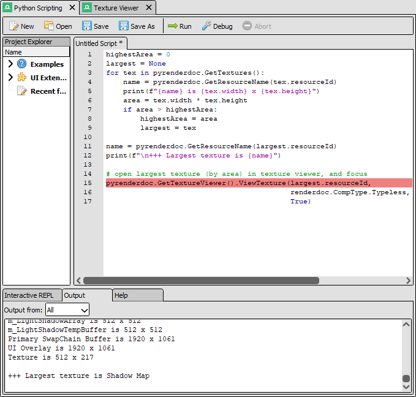

Python Scripting
================

The python scripting panel allows the management of python scripts and extensions.

Overview
--------

	The python shell

You can open the python scripting panel from the window menu. It offers both an interactive ``REPL`` and a window that can open and run scripts and display the output. The editor has limited auto-complete and error checking, though for complex scripts editing in an external IDE is recommended.

A number of included example scripts are included for running to demonstrate use of the python APIs that RenderDoc exposes.

The full :doc:`python API <../python_api/index>` documentation contains a guide on how to get started with writing python scripts and UI extensions.

To get started the :code:`pyrenderdoc` object corresponds to a :class:`~qrenderdoc.CaptureContext` object through which the internal API and UI windows can be obtained.

For Qt integration, if available, you can import :code:`PySide2` which provides python bindings for the Qt API.

See Also
--------

* :doc:`../python_api/index`
* :doc:`../how/how_python_extension`
